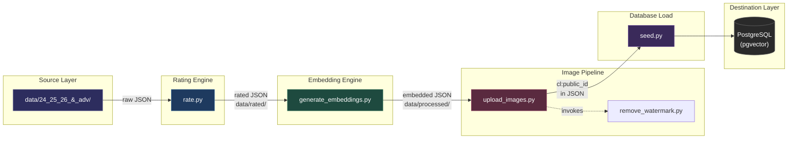
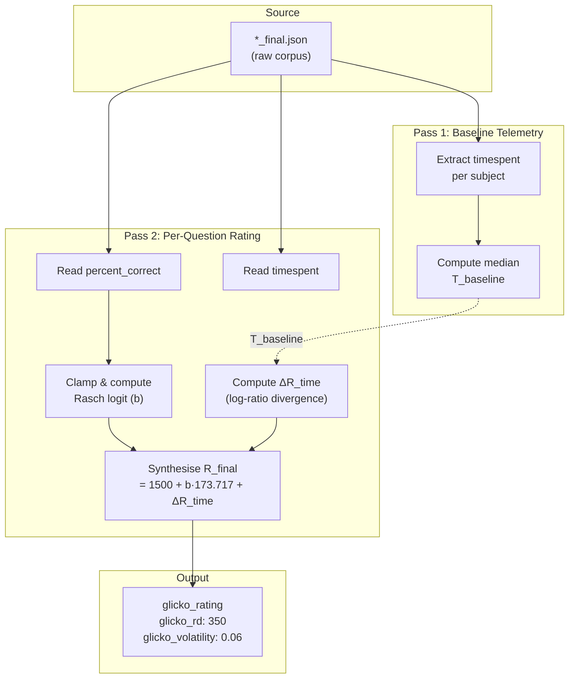
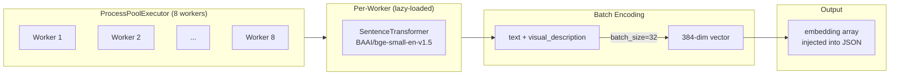
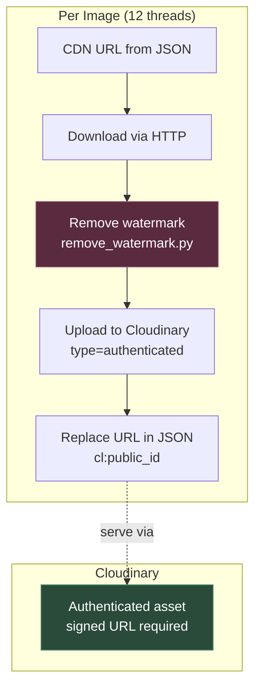
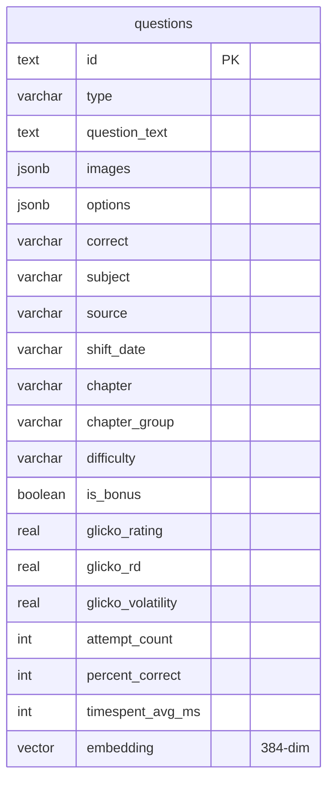
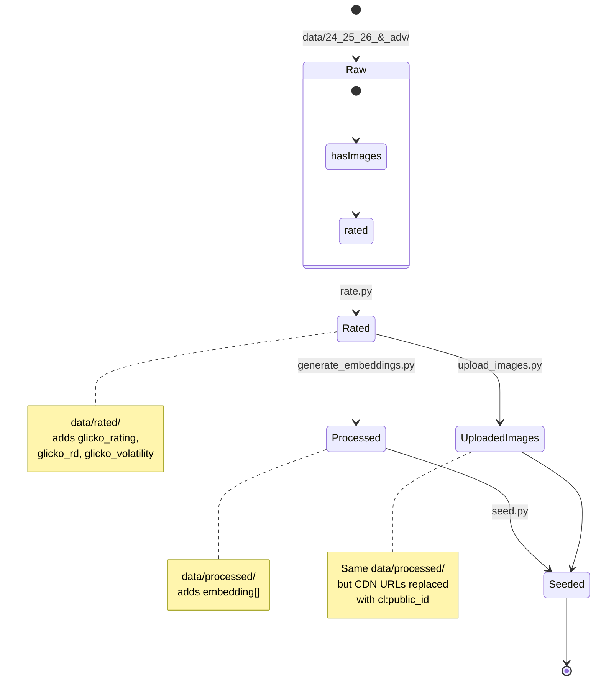

# Preprocessing Pipeline Architecture

The preprocessing pipeline transforms raw JEE question data (JSON) into a database-ready corpus enriched with psychometric ratings, semantic embeddings, watermark-free images, and Cloudinary-backed asset URLs.

---

## 1. Pipeline Overview

Four sequential phases execute in a directed acyclic graph (DAG). Each phase reads from a dedicated directory and writes to the next stage's input directory.



### 1.1 Execution Order

| Command | Phase | Entry Point |
|---|---|---|
| `just embed` | 1 — Rating | `preprocess/rate.py` |
| `just embed` | 2 — Embedding | `preprocess/generate_embeddings.py` |
| `just upload-images` | 3 — Image Upload | `preprocess/scripts/upload_images.py` |
| `just seed` | 4 — Database Seed | `preprocess/seed.py` |

The compound recipe `just embed-all` runs phases 1 and 2 sequentially.

---

## 2. Rating Engine (`rate.py`)

Computes item-difficulty metrics by synthesising a Glicko rating from correctness telemetry and response-time divergence.

### 2.1 Data Flow



### 2.2 Glicko Rating Synthesis

**Rasch Logit Difficulty**

$$p = \text{clamp}\left(\frac{P}{100}, 0.001, 0.999\right) \quad \quad b = \ln\left(\frac{1-p}{p}\right)$$

**Time Divergence Modifier**

$$T_{\text{baseline}} = \text{median}(\{t_{\text{sec}} \mid \text{question} \in \text{Subject}\})$$

$$\Delta R_{\text{time}} = 150.0 \times \ln\left(\frac{t_c}{T_{\text{baseline}}}\right), \quad \text{clamped to } \pm 200$$

**Final Rating**

$$R_{\text{final}} = \text{round}\big(1500.0 + (b \times 173.717) + \Delta R_{\text{time\_clamped}}\big)$$

| Parameter | Value | Source |
|---|---|---|
| `glicko_rating` | `R_final` | Computed per question |
| `glicko_rd` | `350.0` | Fixed (initial uncertainty) |
| `glicko_volatility` | `0.06` | Fixed |

### 2.3 Atomic Disk Commit

All writes follow a three-stage transactional protocol:

1. **Stage**: Serialise to `<file>.json.tmp`
2. **Verify**: Re-parse the temp file to guarantee structural validity
3. **Swap**: `os.replace(tmp, target)` — kernel-level atomic rename

If the process is interrupted, only the temp file is lost; the original remains intact.

---

## 3. Embedding Engine (`generate_embeddings.py`)

Generates 384-dimensional semantic vector embeddings using `BAAI/bge-small-en-v1.5`.

### 3.1 Architecture



### 3.2 Thread Confinement

Environment variables restrict BLAS threading to prevent resource contention across workers:

```
OMP_NUM_THREADS=1   MKL_NUM_THREADS=1
OPENBLAS_NUM_THREADS=1   VECLIB_MAXIMUM_THREADS=1
NUMEXPR_NUM_THREADS=1
```

### 3.3 Text Compilation

Each question's embedding input is concatenated from two fields:

$$\text{input} = \text{strip}(\text{question.text}) + \text{" "} + \text{strip}(\text{question.visual\_description})$$

If both are empty, a fallback empty string is used to preserve array alignment.

### 3.4 Batch Inference

- **Model**: `BAAI/bge-small-en-v1.5` (384 dimensions)
- **Batch size**: 32
- **Hardware**: CPU (GPU fallback not required for this model size)
- **Workers**: 8 (configurable via `max_workers`)

---

## 4. Image Pipeline (`upload_images.py`)

Downloads CDN-hosted images, removes ExamGOAL watermarks, uploads to Cloudinary as authenticated assets, and substitutes CDN URLs with Cloudinary public IDs.

### 4.1 Pipeline Per Image



### 4.2 Watermark Removal (`remove_watermark.py`)

Uses luminance-based alpha matting:

1. Flatten RGBA/transparent images onto a white background
2. Crop browser chrome (dark headers/footers) via row-mean threshold
3. Compute grayscale luminance: $Y = 0.299R + 0.587G + 0.114B$
4. Generate alpha mask between black point (140) and white point (200)
5. Blend: $\text{out} = \alpha \cdot \text{white} + (1 - \alpha) \cdot \text{target\_color}$
6. Apply unsharp mask for clarity (radius=2, percent=150)

### 4.3 Cloudinary Public ID Convention

```
{year}/{shift_id}/{subject}/Q_{qid}_{index}
{year}/{shift_id}/{subject}/Q_{qid}_opt_{option}_{index}
```

After upload, the original CDN URL is replaced with:

```
cl:{public_id}
```

The `cl:` prefix signals downstream that this requires on-the-fly URL signing.

### 4.4 Idempotency

The pipeline skips URLs that already contain `cloudinary.com` or start with `cl:`, making re-runs safe. To force re-upload, revert the JSON files and re-run.

### 4.5 Dry Run Mode

```bash
uv run preprocess/scripts/upload_images.py --dry-run
```

Skips Cloudinary upload; downloads, watermarks, and validates the pipeline locally.

---

## 5. Database Seeding (`seed.py`)

Scans `data/processed/`, parses metadata from filenames (exam source, shift date), and upserts into PostgreSQL via pgvector.

### 5.1 Schema Target



### 5.2 Filename Parsing

Extracts `(source, shift_date)` tuples from file stems:

| Pattern | Source | shift_date |
|---|---|---|
| `2026_j_24_s1_final.json` | JEE Main 2026 | `2026_2401S1` |
| `2025_a_4_s2_final.json` | JEE Main 2025 | `2025_0404S2` |
| `2024_adv_p1_final.json` | JEE Advanced 2024 | `2024_P1` |

### 5.3 Upsert Strategy

Uses `ON CONFLICT (id) DO UPDATE` with two query variants:
- **With embedding**: includes the `vector` column
- **Without embedding**: omits the vector column (for partial pipelines)

### 5.4 Vector Index

After seeding, an HNSW index on `embedding` accelerates cosine-similarity searches:

```sql
CREATE INDEX ON questions USING hnsw (embedding vector_cosine_ops)
WITH (m = 16, ef_construction = 64);
```

---

## 6. Directory State Machine



---

## 7. Configuration Constants

| Name | Value | Location |
|---|---|---|
| `ELO_CENTER` | 1500.0 | `rate.py` |
| `ELO_SCALE` | 173.717 | `rate.py` |
| `TIME_SCALE` | 150.0 | `rate.py` |
| `TIME_CLAMP` | 200.0 | `rate.py` |
| `DEFAULT_BASELINE` | 60.0s | `rate.py` |
| `EMBED_DIM` | 384 | `generate_embeddings.py` |
| `BATCH_SIZE` | 32 | `generate_embeddings.py` |
| `WORKERS` | 8 (embed), 12 (upload) | respective scripts |
| `RETRY_LIMIT` | 3 | `upload_images.py` |
